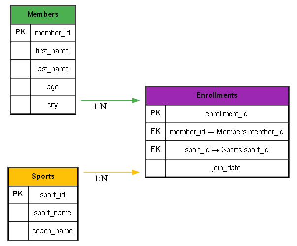

# 🏆 Sports Club Database – Subqueries & Nested Queries

## 📌 Introduction
This project is designed to practice **SQL subqueries** and **nested queries** using a **Sports Club Management System** dataset.

We practice:
- **Scalar subqueries** in `SELECT`
- **Correlated subqueries** in `WHERE`
- Subqueries with `IN` and `EXISTS`
- Inline views (subqueries in `FROM`)

## 🚀 How to Run
1. Open **DB Browser for SQLite** (or MySQL Workbench).
2. Create a new database `Sports_club.db`.
3. Run `schema.sql` to create tables.
4. Run `data.sql` to insert sample data.
5. Run `queries.sql` to try out subquery examples.

## 📂 Files
- `schema.sql` → Database schema (Members, Sports, Enrollments)  
- `data.sql` → Sample dataset  
- `queries.sql` → Example subquery queries  
- `docs/er_diagram.png` → ER Diagram  

## 📊 ER Diagram

## ✅ Outcome
After completing this, you’ll be able to:
- Use **nested queries** inside `SELECT`, `WHERE`, and `FROM`
- Apply **scalar** and **correlated subqueries**
- Filter results with **IN** and **EXISTS**
- Simplify logic using **inline views**
